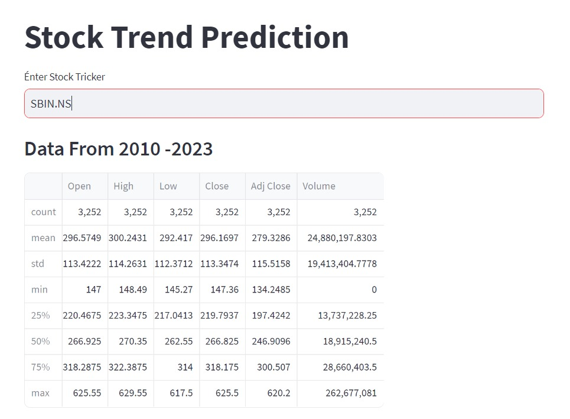

# Stock Trend Prediction using AI

This project predicts stock trends using historical data and machine learning models. The application allows users to interact with stock data, visualize trends, and make predictions based on the stock's historical performance.

## Web UI



## Features

- Allows users to input any stock ticker symbol (e.g., TSLA).
- Displays stock data from 1998 to the current date.
- Shows interactive charts for the stock's closing prices over time.
- Displays moving averages (100MA & 200MA) along with closing prices.
- Predicts stock trends using a trained machine learning model.
- Interactive web interface built with Streamlit.

## Technologies Used

- **Streamlit**: Used for creating the web-based user interface.
- **yfinance**: Fetches historical stock data from Yahoo Finance.
- **Keras**: Used for loading and running the trained machine learning model.
- **Matplotlib**: Used for plotting graphs to visualize stock trends.
- **Pandas**: Used for handling and manipulating stock data.
- **scikit-learn**: Used for data preprocessing and normalization.

## Installation

1. Clone the repository:

```bash
git clone https://github.com/akellasrinivas/Stock-Trend-Prediction-Using-Ai-.git
```
2. Install the required dependencies:

```bash
pip install -r requirements.txt
```
- Run every cell in .ipynb file.

3. Start the application:

```bash
streamlit run app.py
```
4. Open your web browser and visit http://localhost:5000 to access the Application.

## Authors
- Akella Srinivas

## Contribution

Contributions are welcome! If you find any issues or have suggestions for improvements, please feel free to create an issue or submit a pull request.

## License

This project is licensed under the [MIT License](https://opensource.org/licenses/MIT).

## Contact

For any inquiries or further information, please contact [akells srinivas] via email at [akellasrinivas322@gmail.com].

